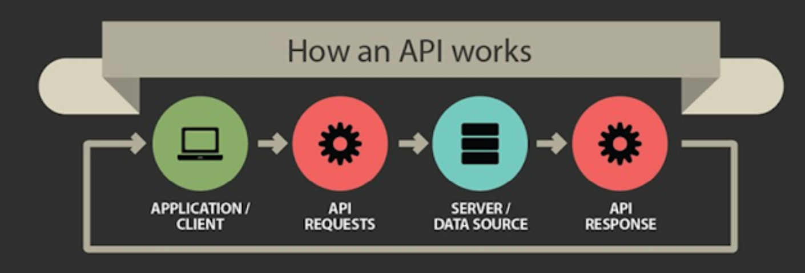
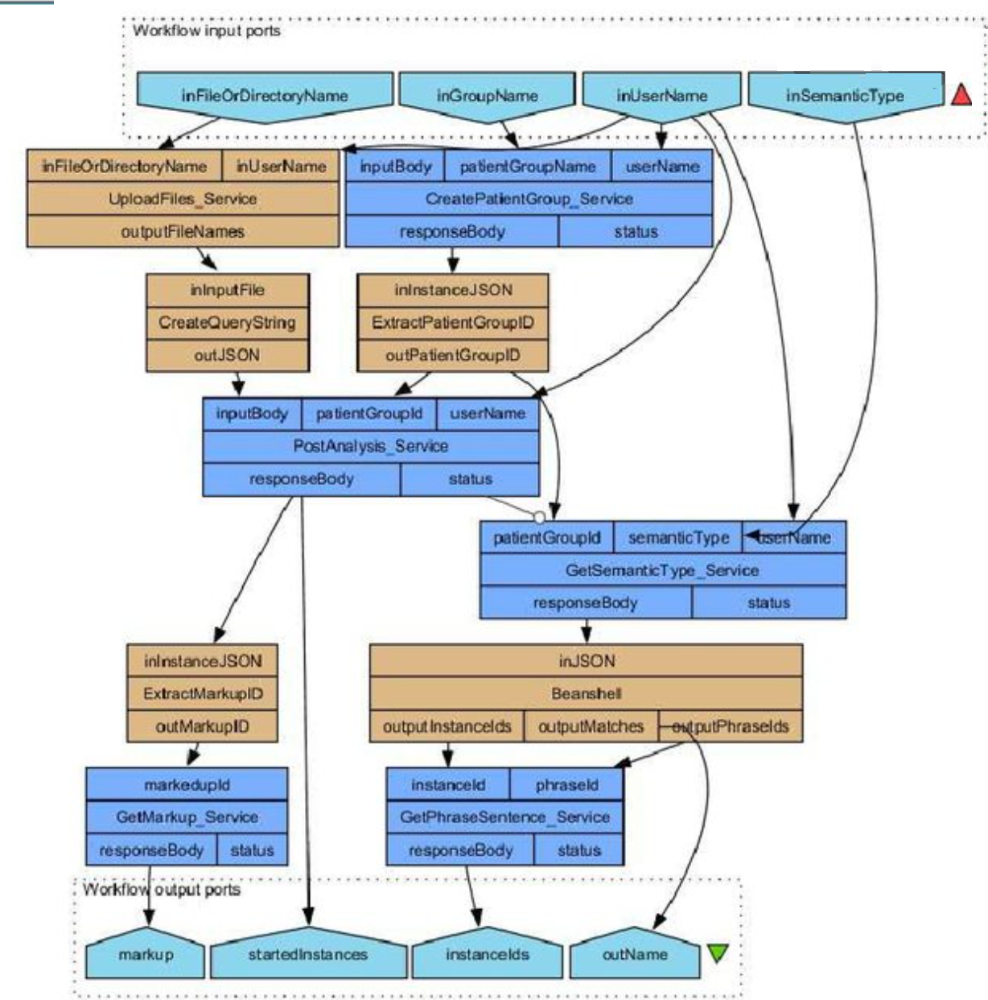
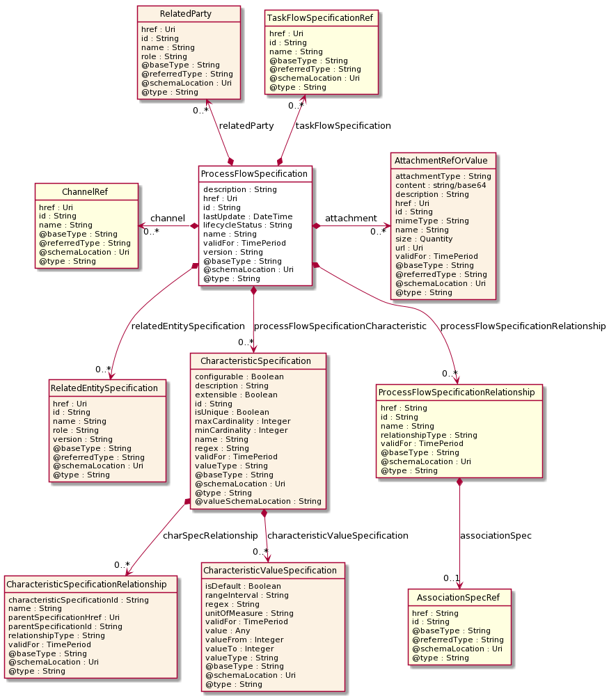
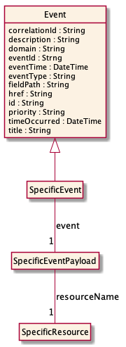
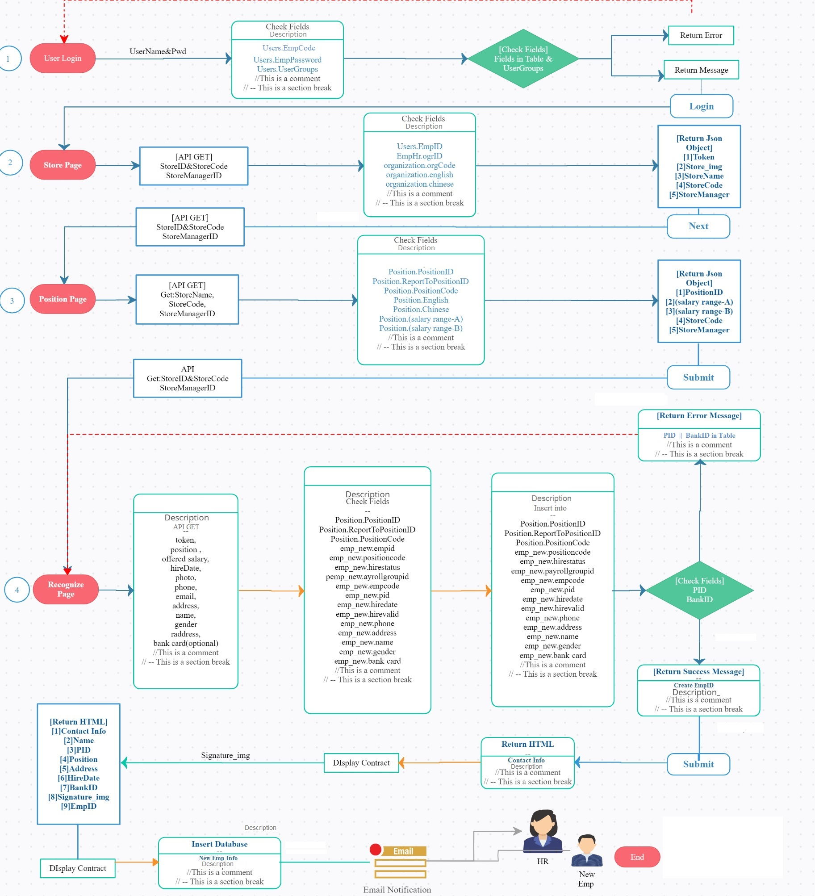
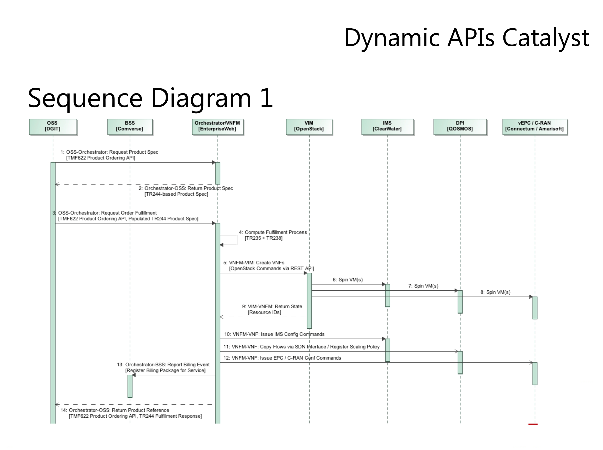
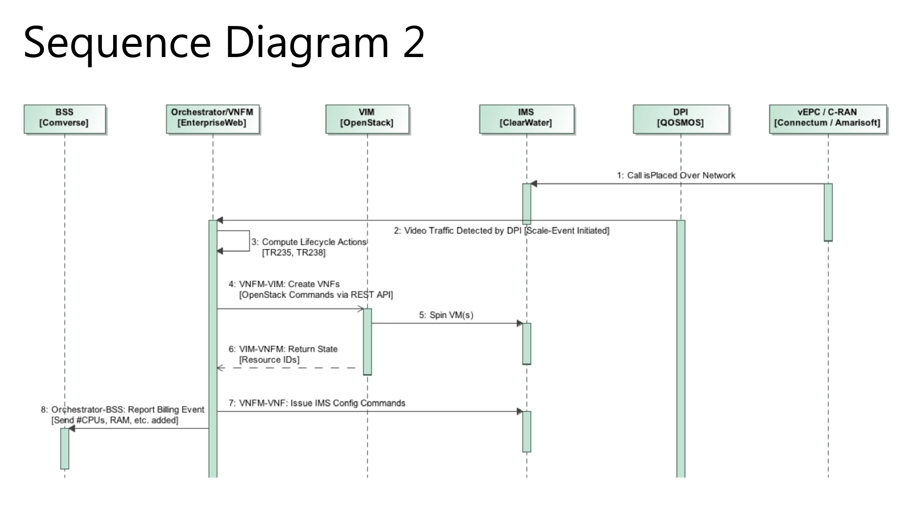

**API Documentation Template**

**\
**

# Release History

Below is an example of Release History.

---------------------------------------------------------------------------------
  Version Number   Description                Date Modified         Author
---------------- -------------------------- --------------------- ---------------
  1.1              Outline                    March 30, 2014        John Smith

  1.2              Draft                      December 05, 2015     John Smith

  1.3              Draft                      January 12, 2015      John Smith

  1.4              Draft                      January 26, 2015      John Smith 

   2.0             Final                       February 16, 2015   John Smith

  
  ---------------------------------------------------------------------------------

**\
**

# **Contents** {#contents .TOC-Heading}

[Release History [2](#release-history)](#release-history)

[Introduction [5](#introduction)](#introduction)

[Overview [5](#overview)](#overview)

[How RESTful APIs work [6](#how-restful-apis-work)](#how-restful-apis-work)

[Uses [7](#uses)](#uses)

[RESTful API Design and Architecture Constraints [7](#restful-api-design-and-architecture-constraints)](#restful-api-design-and-architecture-constraints)

[Common REST API challenges [8](#common-rest-api-challenges)](#common-rest-api-challenges)

[REST vs. SOAP [9](#rest-vs.-soap)](#rest-vs.-soap)

[Key Concepts [9](#key-concepts)](#key-concepts)

[Business Scenario [10](#business-scenario)](#business-scenario)

[Architecture [10](#architecture)](#architecture)

[Example API Structure Diagram [10](#example-api-structure-diagram)](#example-api-structure-diagram)

[Entity API [11](#entity-api)](#entity-api)

[Entity Events [11](#entity-events)](#entity-events)

[Operations on Entity [11](#operations-on-entity)](#operations-on-entity)

[Experience API [11](#experience-api)](#experience-api)

[Workflow [11](#workflow)](#workflow)

[Diagrams [11](#diagrams)](#diagrams)

[Example API Workflow diagram [12](#example-api-workflow-diagram)](#example-api-workflow-diagram)

[Authentication [12](#authentication)](#authentication)

[Use Cases [13](#use-cases)](#use-cases)

[Example Use Cases [13](#example-use-cases)](#example-use-cases)

[Resource Model [14](#resource-model)](#resource-model)

[Example Resource Model diagram [16](#example-resource-model-diagram)](#example-resource-model-diagram)

[Example Resource Model Table [17](#example-resource-model-table)](#example-resource-model-table)

[Example Notification Resource Models [17](#example-notification-resource-models)](#example-notification-resource-models)

[Example Change Management Resource Models [20](#example-change-management-resource-models)](#example-change-management-resource-models)

[Operations on Change Request [20](#operations-on-change-request)](#operations-on-change-request)

[API Operations [20](#api-operations)](#api-operations)

[API Operations Example [20](#api-operations-example)](#api-operations-example)

[API Call flows [21](#api-call-flows)](#api-call-flows)

[Data flow for REST API [22](#data-flow-for-rest-api)](#data-flow-for-rest-api)

[Example Data Flow Operations [23](#example-data-flow-operations)](#example-data-flow-operations)

[API Notifications [24](#api-notifications)](#api-notifications)

[Sequence Diagrams [24](#sequence-diagrams)](#sequence-diagrams)

**\
**

# Introduction

The API documentation contains information on services the API provides and explains how to use and integrate with the API. It includes information on resources, methods, and parameters, supported by tutorials and examples.

An API reference manual covers the information required to work with the API, with details about the use cases, structure, functions, classes, return types, arguments, and more. It contains a path to API, and operation information, such as authentication methods, parameters, request bodies, response bodies, and headers.

# Overview

APIs stand as a go-between for heterogeneous pieces of software. APIs act as a business and technical mediator, or translators between two parties, enabling the passing of information or data requests and responses back and forth.

Explain why your API is needed and include use cases.

-   The business value they can bring/provide

-   How they can be used in a typical business scenario

-   A high-level description of each available API

-   An illustration of their use, based on the description of real-world business scenarios

-   A description of generic usage patterns.

A RESTful API is an architectural style for an application program interface ([API](https://www.techtarget.com/searchapparchitecture/definition/application-program-interface-API)) that uses HTTP requests to access and use data. That data can be used to GET, PUT, POST and DELETE data types, which refers to the reading, updating, creating, and deleting of operations concerning resources.

An API for a website is [code](https://whatis.techtarget.com/definition/code) that allows two software programs to communicate with each other. The API spells out the proper way for a developer to write a program requesting services from an operating system or other application.

A RESTful API -- also referred to as a RESTful web service or REST API -- is based on representational state transfer (REST), which is an architectural style and approach to communications often used in web services development.

REST technology is generally preferred over other similar technologies. This tends to be the case because REST uses less bandwidth, making it more suitable for efficient internet usage. RESTful APIs can also be built with programming languages such as JavaScript or Python.

The REST used by browsers can be thought of as the language of the internet. With cloud use on the rise, APIs are being used by cloud consumers to expose and organize access to web services. REST is a logical choice for building APIs that allow users to connect to, manage and interact with cloud services flexibly in a distributed environment. RESTful APIs are used by such sites as Amazon, Google, LinkedIn and Twitter.

## How RESTful APIs work

A RESTful API breaks down a transaction to create a series of small modules. Each module addresses an underlying part of the transaction. This modularity provides developers with a lot of flexibility, but it can be challenging for developers to design their REST API from scratch. Currently, several companies provide models for developers to use; the models provided by Amazon S3, Cloud Data Management Interface (CDMI) and OpenStack Swift are the most popular.

A RESTful API uses commands to obtain resources. The state of a resource at any given timestamp is called a resource representation. A RESTful API uses existing HTTP methodologies defined by the RFC 2616 protocol, such as:

-   GET to retrieve a resource;

-   PUT to change the state of or update a resource, which can be an object, file or block;

-   POST to create that resource; and

-   DELETE to remove it.

With REST, networked components are a resource the user requests access to -- like a black box whose implementation details are unclear. All calls are stateless; nothing can be retained by the RESTful service between executions.

Data formats the REST API supports include:

-   application/json

-   application/xml

-   application/x-wbe+xml

-   application/x-www-form-urlencoded

-   multipart/form-data

> {width="5.696213910761155in" height="1.9350962379702537in"}

### Uses

Because the calls are stateless, REST is useful in cloud applications. Stateless components can be freely redeployed if something fails, and they can scale to accommodate load changes. This is because any request can be directed to any instance of a component; there can be nothing saved that has to be remembered by the next transaction. That makes REST preferable for web use. The RESTful model is also helpful in cloud services because binding to a service through an API is a matter of controlling how the URL is decoded. 

### RESTful API Design and Architecture Constraints

In order to be a truly RESTful API, a web service must adhere to the following six REST architectural constraints:

-   **Use of a uniform interface (UI)**. Resources should be uniquely identifiable through a single URL, and only by using the underlying methods of the network protocol, such as DELETE, PUT and GET with HTTP, should it be possible to manipulate a resource.

-   **Client-server based**. There should be a clear delineation between the client and server. UI and request-gathering concerns are the client\'s domain. Data access, workload management and security are the server\'s domain. This loose coupling of the client and server enables each to be developed and enhanced independently of the other.

-   **Stateless operations**. All client-server operations should be stateless, and any state management that is required should take place on the client, not the server.

-   **RESTful resource [caching](https://whatis.techtarget.com/definition/caching)**. All resources should allow caching unless explicitly indicated that caching is not possible.

-   **Layered system**. REST allows for an architecture composed of multiple layers of servers.

-   **Code on demand**. Most of the time, a server will send back static representations of resources in the form of XML or JSON. However, when necessary, servers can send executable code to the client.

### Common REST API challenges

Besides the design and architecture constraints, individuals will have to confront some challenges with REST APIs. Some concepts which may be challenging can include:

-   Endpoint consistency -- paths of endpoints should be consistent by following common web standards, which may be difficult to manage.

-   API versioning -- endpoint URLs shouldn\'t be invalidated when used internally or with other applications.

-   Long response times and too much data -- the amount of returned resources can increase in size in time, adding to increased load and response times.

-   Navigation paths and user input locations -- because REST uses URL paths for input parameters, determining URL spaces can be challenging.

-   Security -- which has a lot of aspects to keep an eye on, including the use of:

    -   HTTPS;

    -   blocking access from unknown IP addresses and domains;

    -   validating URLs;

    -   blocking unexpectedly large payloads;

    -   logging requests; and

    -   investigating failures.

-   Authentication -- use common authentication methods such as HTTP basic authentication (which allows for a base64-encoded username:password string), API keys, JSON Web Tokens and other access tokens. OAuth 2.0, for example, is good for access control.

-   Requests and data -- requests may have more data and metadata than needed or more requests may be needed to obtain all the data. APIs can be adjusted for this.

-   API testing -- can be a long process to set up and run. Each part of the process can be either long or challenging. Testing can also be done in the command line with the utility Curl. Parts of the testing process that may be challenging include:

-   Initial setup

    -   Schema updates

    -   Test parameter combinations

    -   Sequence API calls

    -   Validate test parameters

    -   System integration

-   Define error codes and messages.

    -   With error codes, it is more of a common practice to use standard HTTP error codes. These are recognized by clients and developers more often.

    -   Error handling may not have a way to distinguish if a response is successful or not besides parsing the body or checking for an error.

### REST vs. SOAP

REST and Simple Object Access Protocol (SOAP) offer different methods to invoke a web service. REST is an architectural style, while SOAP defines a standard communication protocol specification for XML-based message exchange. REST applications can use SOAP.

RESTful web services are stateless. A REST-based implementation is simple compared to SOAP, but users must understand the context and content being passed along, as there\'s no standard set of rules to describe the REST web services interface. REST services are useful for restricted profile devices, such as mobile, and are easy to integrate with existing websites.

SOAP requires less plumbing code -- meaning low-level, infrastructural code that connects main code modules together -- than REST services design. The Web Services Description Language describes a common set of rules to define the messages, bindings, operations and location of the service. SOAP web services are useful for [asynchronous](https://whatis.techtarget.com/definition/synchronous-asynchronous-API) processing and invocation.

**REST API Specification Information**

For each REST API specification, the following information should be included:

• Purpose of the API.

• URL of resources and API including the version number.

• HTTP verbs supported.

• Representations supported: JSON ( XML is optional)

• Response schema (*and where PUT, POST, PATCH are supported -- request schema*).

• Links supported

• Response status codes supported.

# Key Concepts

APIs typically have important concepts that you may need to describe. This usually depends on the area of knowledge around what the API does. For each concept, write a paragraph or two explaining what it is and how it works. For example, for a learning management system, key concepts might be roles, in other words, the teacher, student, administrator, etc. An online banking system might have concepts like accounts and transactions.

Include the following sub-sections:

-   What is REST?

-   What is Domain-Driven Design?

-   What is the TM Forum?

-   What are the TMF Open APIs?

-   What are the API Categories?

-   What is a Microservice?

-   What is Event-Driven Architecture?

## Business Scenario 

This section:

-   Details business scenarios, industry-specific and coming from real-life.

-   Presents a use case for a given domain

-   Includes diagrams presenting a sequence of operations and interactions between players.

 

## Architecture

The Architecture section provides a high-level overview of the API components. You need to explain the major pieces of the API, and then explain how all those pieces fit together. You might want to include an architecture diagram.

### Example API Structure Diagram

## Entity API

The Entity System is the API for entities manipulation (CRUD: create, read, update, delete). Entity validation has its own API (which could validate an Entity saved via REST, rather than a form, for example).

### Entity Events 

-   Entity Create Event

-   Entity Change Event

-   Entity Delete Event

### Operations on Entity

-   List of entities

-   Retrieve entity

-   Create entity

-   Patch entity

-   Delete entity

## Experience API

The Experience API (or xAPI) is a new specification for learning technology that makes it possible to collect data about the wide range of experiences a person has (online and offline). This API captures data in a consistent format about a person or group\'s activities from many technologies.

# Workflow 

Workflow outlines the sequence of API interactions. It\'s pretty common that when you want to do a typical task with an API, you have to make several API calls. The workflow describes the order of these calls. For example, a workflow for playing a song from a playlist involves first getting a list of all playlist and their IDs. The user will then select the playlist. Then you make another call to get the list of songs and IDs for that playlist. You specify the playlist with the ID, then the user selects a song. Finally, you make a third call to request the sound file for that song using a song's ID.

# Diagrams

Diagrams can be useful. The first type is an architecture diagram, which shows how the various pieces of the API fit together. The second type is a workflow diagram, which shows the order of calls that are made. It shows which systems are making API calls to which other system.

## Example API Workflow diagram

{width="6.5236362642169725in" height="6.563706255468066in"}

# Authentication 

The authentication section contains data required to allow the user to authenticate and login settings. It may provide default user names and passwords.

The role-based Access Control section can be included in this section.

# Use Cases

Provide use cases, including key activities. Include API snippets.

## Example Use Cases

The following example describes IssueTrack REST API that allows performing programmatically various actions in the issue tracker:

-   Import issues from the current bug tracking system --- for smoother migration to IssueTrack.

-   Create, modify, and perform other operations with issues --- so developers can seamlessly integrate IssueTrack into their environment. For example, via automated issue submission from third-party applications.

-   Manipulate projects, custom fields and sets of values, agile boards, issue link types, and other parameters.

-   Create an Issue

The IssueTrack REST API allows developers to perform programmatically various actions in the tracker:

-   Import issues from the bug tracking system --- for smoother migration to IssueTrack.

-   Create, modify, and perform other operations with issues --- so you can seamlessly integrate IssueTrack into your environment. For example, via automated issue submission from third-party applications.

-   Manipulate projects, custom fields and sets of values, agile boards, issue link types, and other parameters.

> The following are different operations provided by the IssueTrack REST API.

-   Create an Issue

-   Create an Issue and Set Custom Fields

-   Get Issues List with All Values

-   Get Value for an Issue Custom Field

-   Add Value to a Set

-   Update Issue Custom Fields

-   Update a Text Field Value

-   Clear Values of Custom Fields

-   Apply Commands to Issues

-   Tag or Untag Issues

-   Work with Issue Tags

-   Attach Files to an Issue

-   Download an Issue Attachment

-   Link Issues

-   Get Issue History

-   Get a Database Backup

-   Add User to Project Team

-   Create an Issue and Set Custom Fields

-   Get Issues List with All Values

-   Get Value for an Issue Custom Field

-   Add Value to a Set

-   Update Issue Custom Fields

-   Update a Text Field Value

-   Clear Values of Custom Fields

-   Apply Commands to Issues

-   Tag or Untag Issues

-   Work with Issue Tags

-   Attach Files to an Issue

-   Download an Issue Attachment

-   Link Issues

-   Get Issue History

-   Get a Database Backup

-   Add User to Project Team

# Resource Model

The key abstraction of information in REST is a resource. Any information that can be named can be a resource: a document or image, a temporal service (e.g. "today\'s weather in Los Angeles"), a collection of other resources, a non-virtual object (e.g. a person), and so on. A resource model contains the definition of human and technical resources that are involved in the execution of a workflow model as workflow participants.

Include the following sub-sections:

-   How are resource identifiers used in a REST API?

-   When to use nested resources in an API?

-   How are collections and resources related in an API?

-   How to get multiple resources in one API call?

-   When to use Resource Modeling in API design?

-   Process Flow Specification resource

-   Task flow specification resource

-   Process flow resource

-   Task flow resource

## Example Resource Model diagram

## Example Resource Model Table

> The resource model description includes a table for each Resource Model. The fields of this table are:

-------------------------------------------------------------------------------------------------------------------------------------------------------------------------------------------
  **Field Name**    Name of each xml or json element or attribute in the Resource Model. Attribute names are preceded by @ (E.g., \@total). Key fields are preceded by \* (E.g., \*id).
----------------- -------------------------------------------------------------------------------------------------------------------------------------------------------------------------
  **Type**          Data Type for each field. Valid field types are: int, string, boolean, URI, \<custom\>, \<custom\> \[\].

  **Occurs**        Number of times this field can occur in the Resource Model. Possible values are 0, 1, 0..N, 1..N.

  **Description**   Field description.

  **GET**           Whether this field is included in the HTTP Response of a GET Request. All Resource Model fields are always included in a GET Response. (Y means the field is included).

  **PUT/POST**      Whether it is required to specify this field in the HTTP Request Body of a PUT or a POST method. (Y means the field is required).

  **PATCH**         Whether this field can be patched in the HTTP Request Body of a PATCH Request. (Y means the field can be patched).

  **Sort**          Whether the field is sort-able on the GET response. Sort is only applicable to collection fields..

  **Filter**        Whether the field is filter-able on the GET response. Filter is only applicable to collection fields..
  -------------------------------------------------------------------------------------------------------------------------------------------------------------------------------------------

## Example Notification Resource Models

In this example, 5 notifications are defined for the API.

Notifications related to ChangeRequest:

-   ChangeRequestCreateEvent

-   ChangeRequestStatusChangeEvent

-   ChangeRequestDeleteEvent

-   ChangeRequestAttributeValueChangeEvent

-   ChangeRequestApprovalRequiredEvent

The notification structure for all notifications in this example API follows the pattern depicted by the figure below.\
A notification event resource (depicted by \"SpecificEvent\" placeholder) is a subclass of a generic Event structure containing at least an ID of the event occurrence (eventId), an event timestamp (eventTime), and the name of the resource (eventType).

This notification structure owns an event payload structure (\"SpecificEventPayload\" placeholder) linked to the resource concerned by the notification using the resource name as access field (\"resourceName\" placeholder).

> 

**\
**

## Example Change Management Resource Models 

-   Change Request Create Event

-   Change Request Status Change Event

-   Change Request Delete Event

-   Change Request Attribute Value Change Event

-   Change Request Approval Required Event

-   ChangeRequest status Lifecycle

### Operations on Change Request 

-   List change requests

-   Retrieve change request

-   Create change request

-   Patch change request

-   Delete change request

# API Operations 

A RESTful API is an architectural style for an application program interface (API) that uses HTTP requests to access and use data. That data can be used to GET, PUT, POST and DELETE data types, which refers to the reading, updating, creating and deleting of operations concerning resources.

## API Operations Example

-------------------------------------------------------------------------------------------------------------------------
  Operation on Entities            Uniform API Operation   Description
-------------------------------- ----------------------- ----------------------------------------------------------------
  Query Entities                   GET Resource            GET must be used to retrieve a representation of a resource.

  Create Entity                    POST Resource           POST must be used to create a new resource

  Partial Update of an Entity      PATCH Resource          PATCH must be used to partially update a resource

  Remove an Entity                 DELETE Resource         DELETE must be used to remove a resource

  Execute an Action on an Entity   POST on TASK Resource   POST must be used to execute Task Resources

  Other Request Methods            POST on TASK Resource   GET and POST must not be used to tunnel other request methods.
  -------------------------------------------------------------------------------------------------------------------------

# API Call flows

**Example API Call Flow**

This example API Call Flow retrieves a detailed list of customer activities, such as service requests and service appointments.

-   Create Service Request

-   Review Service Request

-   Schedule Service Appointment

-   Update Credit Card

-   Update Customer Account

> **Example API Call Flow Diagram**
>
> 

# Data flow for REST API

**API Data flow example**

## Example Data Flow Operations

-----------------------------------------------------------------------
  Create Or Update Data Flow          Creates or updates a data flow.
----------------------------------- -----------------------------------
  Delete Data Flow                    Deletes a data flow.

  Get Data Flow                       Gets a data flow.

  Get Data Flows By Workspace         Lists data flows.

  Rename Data Flow                    Renames a dataflow.
  -----------------------------------------------------------------------

# API Notifications 

Describe API Notifications if applicable.

# Sequence Diagrams 

Below are example sequence diagrams.

